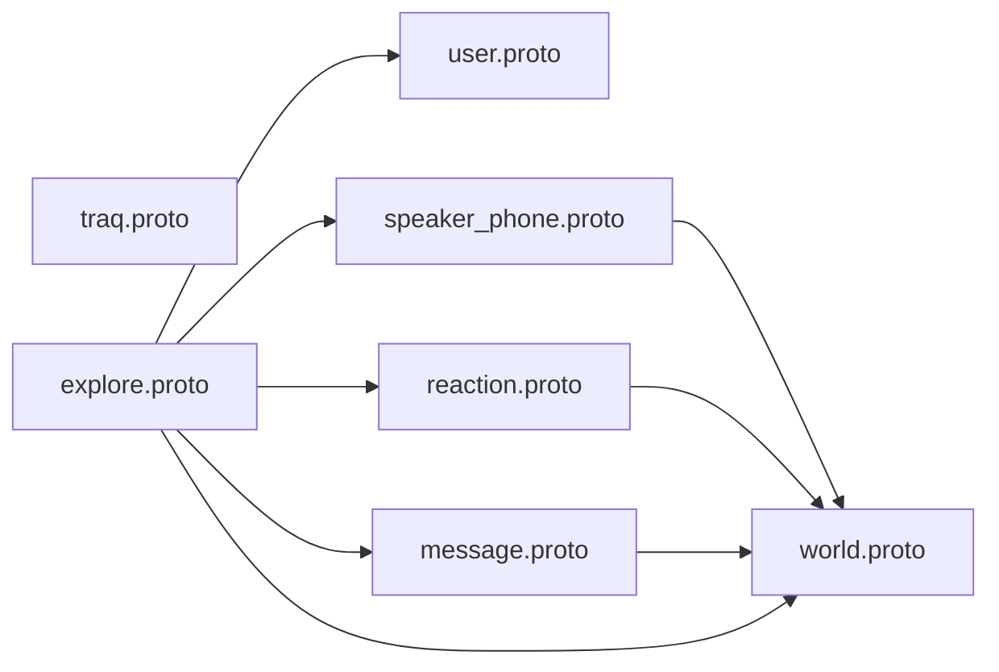

# proto

```mermaid
graph LR
    World[world.proto]
    User[user.proto]
    Traq[traq.proto]
    SpeakerPhone[speaker_phone.proto]
    Reaction[reaction.proto]
    Message[message.proto]
    Explore[explore.proto]

    SpeakerPhone --> World
    Reaction --> World
    Message --> World
    Explore --> World
    Explore --> SpeakerPhone
    Explore --> Reaction
    Explore --> Message
    Explore --> User
```
